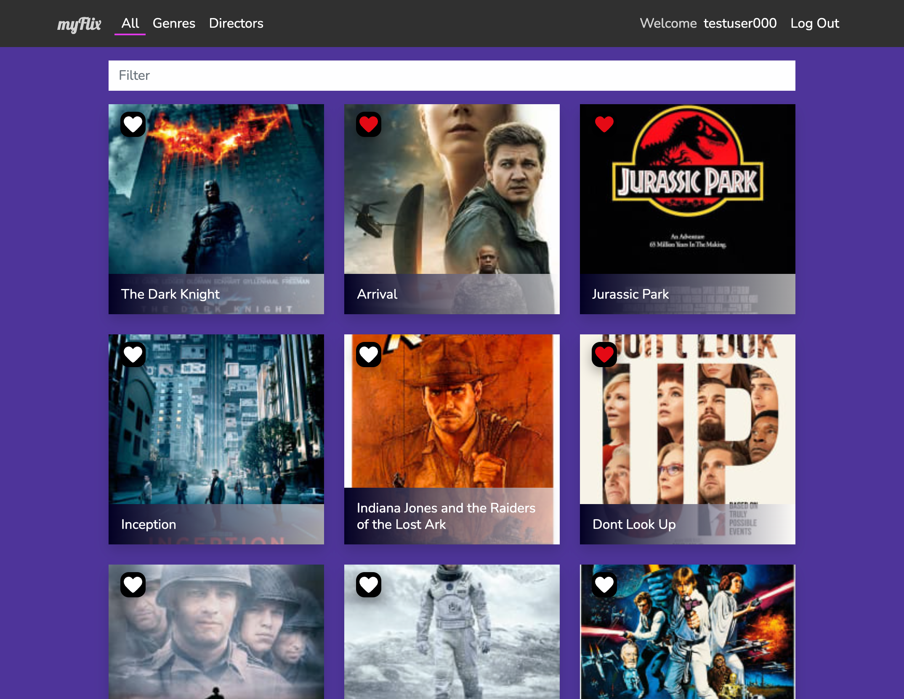

# myFlix - Front End

The client side for a web application for finding information about movies, directors, genres, and keeping track of a list of favorites.

## Table of contents

- [Overview](#overview)
  - [Screenshot](#screenshot)
  - [Links](#links)
  - [Built with](#built-with)
  - [What I learned](#what-i-learned)
  - [Continued development](#continued-development)
- [Author](#author)

## Overview

myFlix is a full stack application build with the MERN stack. The purpose is for finding movies and information about things related to them like the director, summary, and genre. This repo is the front end for the application.

### What it does

Users are able to:

- Create an account.
- View and filter a list of all movies currently in the api.
- View genres and the movies that are in that genre.
- View directors, their bio, and movies that were directed by them.
- Add and remove movies from a list of favorites.
- Edit their account information.
- Delete their account.

### Screenshots



### Links

- Live Site URL: [Here](https://myflix-5f2a35.netlify.app/)

-Test credentials
Username: testaccount
Password: password

### Built with

- React
- Redux
- React Bootstrap
- SASS
- Javascript
- ES6
- Axios

### What I learned

During this project I learned how to create a feature using a component where a user can toggle a favorite throughout the application wherever there is a MovieCard component. 

- The problem:
Must show the current status of that movie, is it favorited or not.
Must be able to click and add or remove that movie.

-The solution:
Check if the movie for the card being rendered is in the favorite list and display the icon according to the result.
When the icon is clicked the movie is passed to the FavoriteToggle component as a prop and the favorite toggle handles sending the correct request to the api to either add or remove the movie from the list based on if the movie is currently a favorite or not.

-From the MovieCard component, this function runs when the component is mounted or updated to set the state for if the movie is a favorite.

```js
 // Check movie id is in current favorites list from redux
  checkIsFavorite() {
    const { movie, favorites } = this.props;
    if (favorites.indexOf(movie._id) !== -1) {
      this.setState({
        isFavorite: true,
      });
    } else {
      this.setState({
        isFavorite: false,
      });
    }
  }
```

- Inside the FavoriteToggle when clicked either addToFavorites or removeFromFavorites will run based on the isFavorite prop.

```js
      <button
          className="favorite-toggle"
          type="button"
          onClick={() => {
            if (!isFavorite) {
              addToFavorites();
            } else {
              removeFromFavorites();
            }
          }}
          >
        <-svg code here->
      </button>


```

### Continued development

In the future I would like to add a way for users to add movie information to the application on their own, as well as a way to track how many users have favorited a movie and display that information in the UI.

## Author

- Website - [Curtis Gray](https://curtisgry.github.io/portfolio-website/)